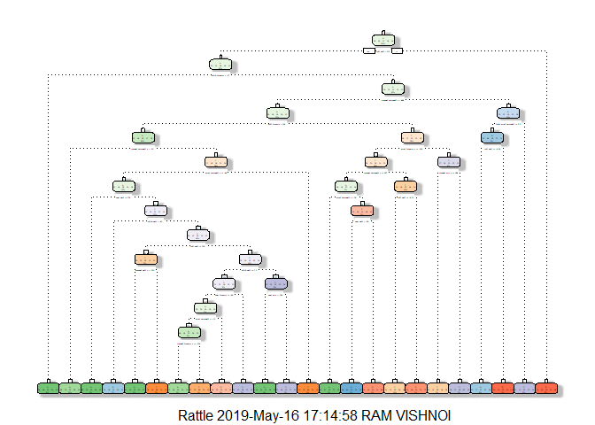

### By :-   Vimal Kushwaha


## Introduction 
Using devices such as Jawbone Up, Nike FuelBand, and Fitbit it is now possible to collect a large amount of data about personal activity relatively inexpensively. These type of devices are part of the quantified self movement – a group of enthusiasts who take measurements about themselves regularly to improve their health, to find patterns in their behavior, or because they are tech geeks. One thing that people regularly do is quantify how much of a particular activity they do, but they rarely quantify how well they do it. In this project, your goal will be to use data from accelerometers on the belt, forearm, arm, and dumbell of 6 participants. They were asked to perform barbell lifts correctly and incorrectly in 5 different ways. More information is available from the website here: http://web.archive.org/web/20161224072740/http:/groupware.les.inf.puc-rio.br/har (see the section on the Weight Lifting Exercise Dataset).

## Data

The training data for this project are available here:

https://d396qusza40orc.cloudfront.net/predmachlearn/pml-training.csv

The test data are available here:

https://d396qusza40orc.cloudfront.net/predmachlearn/pml-testing.csv

The data for this project come from this source: http://web.archive.org/web/20161224072740/http:/groupware.les.inf.puc-rio.br/har.

## Data Preprocessing 
Loading the required packages

```r
library(knitr)
```

```
## Warning: package 'knitr' was built under R version 3.4.4
```

```r
library(caret)
```

```
## Warning: package 'caret' was built under R version 3.4.4
```

```
## Loading required package: lattice
```

```
## Loading required package: ggplot2
```

```
## Warning: package 'ggplot2' was built under R version 3.4.4
```

```r
library(rpart)
```

```
## Warning: package 'rpart' was built under R version 3.4.4
```

```r
library(rpart.plot)
```

```
## Warning: package 'rpart.plot' was built under R version 3.4.4
```

```r
library(randomForest)
```

```
## Warning: package 'randomForest' was built under R version 3.4.4
```

```
## randomForest 4.6-14
```

```
## Type rfNews() to see new features/changes/bug fixes.
```

```
## 
## Attaching package: 'randomForest'
```

```
## The following object is masked from 'package:ggplot2':
## 
##     margin
```

```r
library(corrplot)
```

```
## Warning: package 'corrplot' was built under R version 3.4.4
```

```
## corrplot 0.84 loaded
```

```r
library(rattle)
```

```
## Warning: package 'rattle' was built under R version 3.4.4
```

```
## Rattle: A free graphical interface for data science with R.
## Version 5.2.0 Copyright (c) 2006-2018 Togaware Pty Ltd.
## Type 'rattle()' to shake, rattle, and roll your data.
```

```
## 
## Attaching package: 'rattle'
```

```
## The following object is masked from 'package:randomForest':
## 
##     importance
```

```r
library(tidyverse)
```

```
## Warning: package 'tidyverse' was built under R version 3.4.4
```

```
## -- Attaching packages ------------------------------------------- tidyverse 1.2.1 --
```

```
## v tibble  2.1.1       v purrr   0.3.2  
## v tidyr   0.8.0       v dplyr   0.8.0.1
## v readr   1.3.1       v stringr 1.3.0  
## v tibble  2.1.1       v forcats 0.4.0
```

```
## Warning: package 'tibble' was built under R version 3.4.4
```

```
## Warning: package 'tidyr' was built under R version 3.4.4
```

```
## Warning: package 'readr' was built under R version 3.4.4
```

```
## Warning: package 'purrr' was built under R version 3.4.4
```

```
## Warning: package 'dplyr' was built under R version 3.4.4
```

```
## Warning: package 'stringr' was built under R version 3.4.4
```

```
## Warning: package 'forcats' was built under R version 3.4.4
```

```
## -- Conflicts ---------------------------------------------- tidyverse_conflicts() --
## x dplyr::combine()       masks randomForest::combine()
## x dplyr::filter()        masks stats::filter()
## x dplyr::lag()           masks stats::lag()
## x purrr::lift()          masks caret::lift()
## x randomForest::margin() masks ggplot2::margin()
```

```r
library(dplyr)
library(readr)
library(e1071)
```

```
## Warning: package 'e1071' was built under R version 3.4.4
```

Loading the training and test dataset

```r
training.data<-read.csv("training.csv", na.strings=c("NA","#DIV/0!",""))

testing.data<-read.csv("testing.csv", na.strings=c("NA","#DIV/0!",""))
```

Cleaning the data

```r
characteristics<-names(testing.data[,colSums(is.na(testing.data))==0])[8:59]
training.data<-training.data[,c(characteristics,"classe")]
testing.data<-testing.data[,c(characteristics,"problem_id")]
dim(training.data)
```

```
## [1] 19622    53
```

```r
dim(testing.data)
```

```
## [1] 20 53
```


## Partitioning the data

```r
set.seed(1578)
partition<-createDataPartition(training.data$classe,p=0.6,list=FALSE)
training_data<-training.data[partition,]
testing_data<-training.data[-partition,]
dim(training_data)
```

```
## [1] 11776    53
```

```r
dim(testing_data)
```

```
## [1] 7846   53
```

## Building the Decison Tree model

```r
model<-rpart(classe~.,data=training_data,method="class")
fancyRpartPlot(model)
```

```
## Warning: labs do not fit even at cex 0.15, there may be some overplotting
```

<!-- -->

## Prediction using Decison tree model

```r
prediction<-predict(model,testing_data,type="class")
confusionMatrix(prediction,testing_data$classe)
```

```
## Confusion Matrix and Statistics
## 
##           Reference
## Prediction    A    B    C    D    E
##          A 2100  333   39  143   45
##          B   40  696   59   20   70
##          C   41  269 1162  130  173
##          D   23  100  107  895  110
##          E   28  120    1   98 1044
## 
## Overall Statistics
##                                           
##                Accuracy : 0.7516          
##                  95% CI : (0.7419, 0.7611)
##     No Information Rate : 0.2845          
##     P-Value [Acc > NIR] : < 2.2e-16       
##                                           
##                   Kappa : 0.6841          
##  Mcnemar's Test P-Value : < 2.2e-16       
## 
## Statistics by Class:
## 
##                      Class: A Class: B Class: C Class: D Class: E
## Sensitivity            0.9409  0.45850   0.8494   0.6960   0.7240
## Specificity            0.9002  0.97013   0.9054   0.9482   0.9614
## Pos Pred Value         0.7895  0.78644   0.6546   0.7247   0.8087
## Neg Pred Value         0.9745  0.88191   0.9661   0.9409   0.9393
## Prevalence             0.2845  0.19347   0.1744   0.1639   0.1838
## Detection Rate         0.2677  0.08871   0.1481   0.1141   0.1331
## Detection Prevalence   0.3390  0.11280   0.2262   0.1574   0.1645
## Balanced Accuracy      0.9206  0.71432   0.8774   0.8221   0.8427
```

## Building the Random Forest Model

```r
model.RF<-randomForest(classe~.,data=training_data,ntree=1000)
```

## Prediction using Random Forest Model

```r
prediction.RF<-predict(model.RF,testing_data,type='class')
confusionMatrix(prediction.RF,testing_data$classe)
```

```
## Confusion Matrix and Statistics
## 
##           Reference
## Prediction    A    B    C    D    E
##          A 2228    6    0    4    0
##          B    4 1509    4    0    0
##          C    0    3 1361    6    1
##          D    0    0    3 1274    1
##          E    0    0    0    2 1440
## 
## Overall Statistics
##                                          
##                Accuracy : 0.9957         
##                  95% CI : (0.9939, 0.997)
##     No Information Rate : 0.2845         
##     P-Value [Acc > NIR] : < 2.2e-16      
##                                          
##                   Kappa : 0.9945         
##  Mcnemar's Test P-Value : NA             
## 
## Statistics by Class:
## 
##                      Class: A Class: B Class: C Class: D Class: E
## Sensitivity            0.9982   0.9941   0.9949   0.9907   0.9986
## Specificity            0.9982   0.9987   0.9985   0.9994   0.9997
## Pos Pred Value         0.9955   0.9947   0.9927   0.9969   0.9986
## Neg Pred Value         0.9993   0.9986   0.9989   0.9982   0.9997
## Prevalence             0.2845   0.1935   0.1744   0.1639   0.1838
## Detection Rate         0.2840   0.1923   0.1735   0.1624   0.1835
## Detection Prevalence   0.2852   0.1933   0.1747   0.1629   0.1838
## Balanced Accuracy      0.9982   0.9964   0.9967   0.9950   0.9992
```

## Prediction on testing data using decison tree model

```r
predict.test.DT<-predict(model,testing.data,type="class")
predict.test.DT
```

```
##  1  2  3  4  5  6  7  8  9 10 11 12 13 14 15 16 17 18 19 20 
##  C  A  A  A  A  E  D  A  A  A  C  C  B  A  C  E  A  A  A  B 
## Levels: A B C D E
```

## Prediction on testing data using random forest model

```r
predict.test.RF<-predict(model.RF,testing.data,type="class")
predict.test.RF
```

```
##  1  2  3  4  5  6  7  8  9 10 11 12 13 14 15 16 17 18 19 20 
##  B  A  B  A  A  E  D  B  A  A  B  C  B  A  E  E  A  B  B  B 
## Levels: A B C D E
```

## Conclusion 
As the confusion matrix we got from the random forest is more accurate i.e. 99% as compared to decision tree model.Therefore we will consider the random forest model to answer the questions of the assignment.
